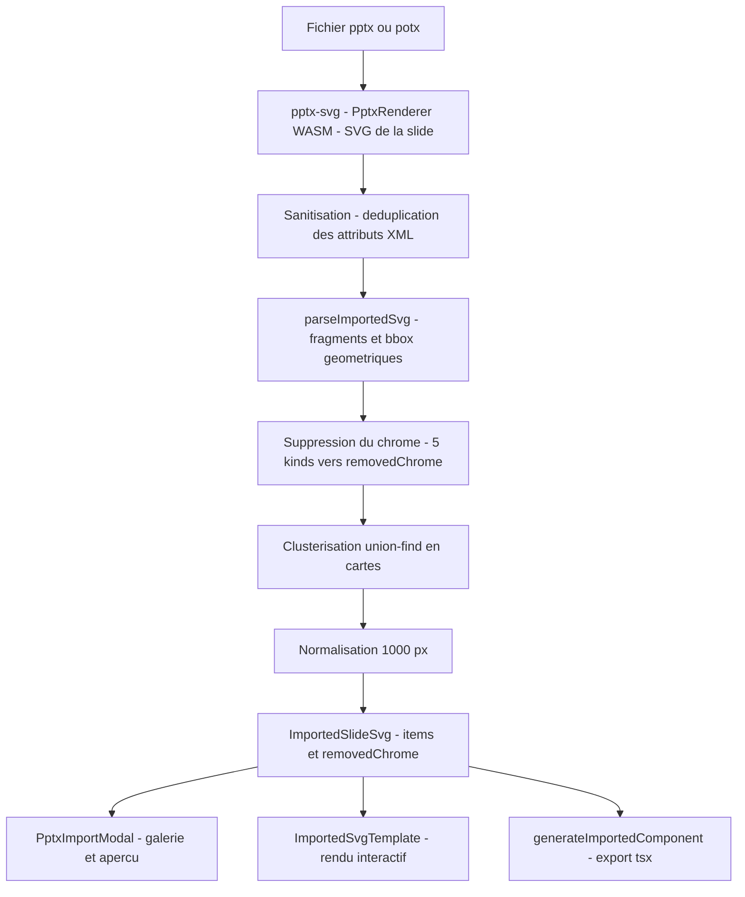

# Moteur d'import vectoriel PPTX → templates segmentés

Le moteur d'import (branche `moteur_import`) transforme une diapositive PowerPoint réelle
(`.pptx`/`.potx`) en template éditable : la slide est rendue en SVG vectoriel haute
fidélité, puis segmentée automatiquement en éléments pilotables par le DSL et
l'interface (survol, clic, sélection, titres éditables, couleurs).

Code principal : `src/templates/import/svgImport.ts` (parsing + segmentation),
`src/templates/components/PptxImportModal.tsx` (UI), `src/templates/components/ImportedSvgTemplate.tsx`
(rendu interactif), `src/templates/import/generateImportedComponent.ts` (export `.tsx`).

---

## 1. Pipeline général



## 2. Rendu pptx-svg et ses limites

La librairie `pptx-svg` (WASM, chargé via `pptx-svg/wasm?url`) produit le SVG de chaque
slide et expose les métadonnées des shapes via des attributs `data-ooxml-*`.

Deux limites connues, prises en charge côté application :
* **`data-ooxml-id` jamais émis** : pptx-svg n'émet pas cet attribut. Les items sont
  alors identifiés positionnellement (`shape-1`, `shape-2`, ...) par la clusterisation.
* **Attributs XML dupliqués** : pptx-svg émet des `font-size` en double sur les runs
  en exposant/indice, ce qui produit un SVG invalide rejeté par `DOMParser`.

## 3. Sanitisation du SVG

`parseImportedSvg` tente d'abord un parsing direct (`tryParseSvg`). En cas d'échec
(`parsererror` ou racine non-`svg`), il applique `sanitizeInvalidSvg` puis retente :

* `sanitizeInvalidSvg` parcourt le SVG balise par balise (avec gestion des guillemets)
  et passe chaque balise ouvrante à `deduplicateTagAttributes`.
* `deduplicateTagAttributes` déduplique les attributs en **gardant la dernière
  occurrence** de chaque attribut (cas du `font-size` dupliqué des exposants/indices).

Si le parsing échoue après sanitisation, `parseImportedSvg` lève `SVG invalide`.

## 4. Parsing et boîtes englobantes

Chaque enfant top-level du `<svg>` (hors `defs`) devient un **fragment** avec :
* son markup sérialisé ;
* ses lignes de texte (`<text>`, dédupliquées) ;
* sa couleur dominante (`fill` le plus fréquent, hors `none` et `url(...)`) ;
* sa bbox géométrique : les shapes (`rect`, `circle`, `ellipse`, `line`, `polygon`,
  `polyline`, `path`, `image`) sont calculées localement puis transformées par la
  composition des matrices `transform` (translate/scale/rotate/matrix/skew) le long
  de l'arbre DOM. Les fragments purement textuels utilisent une boîte approchée
  ancrée sur `x`/`y` (`textAnchorBox`).
* un `scale` global `1000 / largeurSlide` est appliqué dès le parsing (voir § 7).

## 5. Suppression du chrome (`removedChrome[]`)

Les fragments identifiés comme décoratifs sont retirés et tracés dans `removedChrome[]`
avec un `kind` parmi cinq valeurs :

| kind | Critère (ordre d'évaluation) |
| --- | --- |
| `known` | Le texte du fragment (une ligne entière, insensible à la casse) figure dans `KNOWN_CHROME_TEXTS` : `EXAMPLE TEMPLATES`, `MIGSO-PCUBED` |
| `background` | Aire du fragment ≥ 85 % de l'aire de la slide (`CHROME_BACKGROUND_AREA_RATIO`) |
| `title` | Fragment avec texte, positionné en haut (`y` ≤ 20 % de la hauteur) ET (texte pur OU largeur ≥ 60 % de la slide) |
| `footer` | Fragment positionné en bas (`y` ≥ 88 % de la hauteur, `CHROME_FOOTER_MIN_Y_RATIO`) |
| `artifact` | Fragment **sans texte** confiné au coin haut-gauche : bord droit ≤ 20 % de la largeur, bord bas ≤ 25 % de la hauteur, largeur ≤ 12 % et hauteur ≤ 12 % |

Chaque entrée `RemovedChromeEntry` porte `{ kind, ooxmlId, text }`. La modal d'import
affiche le compteur « chrome » par slide (ex. 201 artefacts retirés sur le deck MIGSO).

## 6. Clusterisation en cartes (items)

Les fragments de contenu sont regroupés en items via **union-find** (fonction
`clusterIntoItems`). Deux fragments A et B sont fusionnés si (`belongsToSameCard`) :

* **empilés** : chevauchement horizontal ≥ 30 % du plus petit ET écart vertical ≤ 2 %
  de la hauteur de slide (badge posé sur le coin d'une carte) ; **ou**
* **même bande verticale** : chevauchement vertical ≥ 50 % du plus petit ET
  chevauchement horizontal ≥ 30 % (bloc + élément latéral qui se recouvrent).

**Garde « standalone »** : un fragment d'aire ≥ 12 % de la slide ou comptant ≥ 8 formes
n'est jamais fusionné — il constitue un item à part entière.

Les clusters sont triés (haut de boîte puis gauche) et l'identifiant du premier
fragment (ou `shape-N`) devient le `ooxmlId` de l'item. Le texte de l'item est la
concaténation des lignes de ses fragments (`\n`), sa couleur est le premier `fill`
dominant trouvé.

## 7. Normalisation 1000 px

Toute slide est ramenée à une largeur de **1000 px** (`IMPORTED_TEMPLATE_WIDTH`) :
un `scale(1000/largeur)` est composé au transform de chaque fragment top-level et la
hauteur normalisée est arrondie au centième. Le fond blanc de la slide n'est pas
réémis (supprimé comme chrome `background`) pour respecter la règle « pas de fond blanc »
des templates.

## 8. DSL des templates importés

Voir [TEMPLATE_DSL.md § 3.21](./TEMPLATE_DSL.md#321-templates-importés-imported) :

```
@importedRoadmapSlide12
  item "shape-1" "Vision" "Direction stratégique" #2c2b64
  item "shape-2" "Exécution"
  item "shape-3"
```

Le parser (`parseImportedTemplate` dans `src/templates/dsl/parseTemplate.ts`) accepte
tout en-tête commençant par `imported`. `generateDslText` réémet les items
(titre/sous-titre/couleur), garantissant l'aller-retour DSL ↔ données.

## 9. Rendu interactif : `ImportedSvgTemplate`

* Rend le markup SVG de chaque item (via `dangerouslySetInnerHTML`) avec l'attribut
  `data-element-id` (`item-1`, `item-2`, ...).
* `applyOverrides` surcharge la couleur (`fill` non `url()`/`none`) et les textes
  (premier `<text>` = titre, deuxième = sous-titre) depuis le DSL et le store.
* Interactivité standard des templates : drag/resize via `useTemplateDragResize`,
  sélection (`selectedTemplateElementIds`), masquage (`hiddenTemplateElementIds`),
  poignées de transformation.

## 10. Export `.tsx` : `generateImportedComponent`

`generateImportedComponentSource` produit un fichier `.tsx` autonome : le JSON de la
slide (`SLIDE`) et des données par défaut (`DEFAULT_DATA`) embarqués, délégant le rendu
à `ImportedSvgTemplate`. `downloadGeneratedComponent` déclenche le téléchargement
(`NomTemplate.tsx`, nom assaini par `sanitizeImportedName`).

## 11. UI d'import : `PptxImportModal`

Ouverte depuis la Toolbar (`App.tsx`, état `isImportModalOpen`) :

1. Dépôt ou sélection d'un `.pptx`/`.potx` (validation locale de l'extension, drag & drop).
2. Rendu SVG de toutes les slides via `PptxRenderer` (pptx-svg WASM).
3. Liste des slides détectées : nombre d'éléments (`parseImportedSvg().items.length`),
   nombre d'éléments de chrome retirés, couleurs détectées, extrait de texte.
4. Aperçu exact du SVG de la slide sélectionnée.
5. Actions : **Valider** (ajout à la galerie via `store.addImportedTemplate` avec
   `ImportedTemplateRecord { name, label, category, description, slide, data }`,
   nom dédupliqué, puis sélection du template) et **.tsx** (téléchargement du
   composant généré).

## 12. Store et galerie

`src/templates/store.ts` : `importedTemplates: Record<string, ImportedTemplateRecord>`
avec les actions `addImportedTemplate(record)` et `removeImportedTemplate(name)`.
`TemplatePanel` liste les templates importés aux côtés des templates natifs et
`TemplateRenderer` les résout par leur nom enregistré.

## 13. Page d'administration cachée

`src/admin/AdminPage.tsx`, montée dans `src/App.tsx` via le hook réutilisable
`src/hooks/useHashRoute.ts` (routage par hash) :

* Accessible **uniquement** via l'URL `#admin` (aucun lien dans l'interface).
* Protégée par un mot de passe (`ADMIN_PASSWORD`, valeur `administrateur`).
* Liste les templates importés : libellé, catégorie, nom, nombre d'éléments, avec
  suppression individuelle (`removeImportedTemplate`).

## 14. Tests

* `src/templates/import/__tests__/svgImport.test.ts` — sanitisation, chrome,
  clusterisation, normalisation (dont le retrait de l'artefact haut-gauche).
* `src/templates/dsl/__tests__/parseImportedTemplate.test.ts` — parsing du DSL `item`
  (champs positionnels optionnels, couleur seule, tout préfixe `imported`).

## 15. Limites connues

| Limite | Détail |
| --- | --- |
| `data-ooxml-id` absent | pptx-svg n'émet pas d'identifiant : les items sont nommés `shape-N` positionnellement ; renommer l'ordre de la slide change les ids |
| SVG pptx-svg invalide | Attributs `font-size` dupliqués sur les runs exposant/indice ; corrigé par la sanitisation (dernière occurrence gagnante) |
| Mot de passe admin en clair | `ADMIN_PASSWORD` est codé en dur côté client : la page `#admin` n'offre **aucune sécurité réelle** (obfuscation d'interface uniquement) |
| Détection heuristique | Les seuils de chrome/clusterisation sont calibrés sur le gabarit MIGSO (diapositives 16:9) ; des mises en page très différentes peuvent être mal segmentées |
| État en mémoire | Les templates importés vivent dans le store Zustand (session) ; ils ne sont pas persistés côté serveur |
| Script CLI distinct | `npm run template:from-pptx` (`scripts/pptxToTemplate.ts`) suit une approche historique différente (parsing OOXML direct du zip, sans pptx-svg) |
